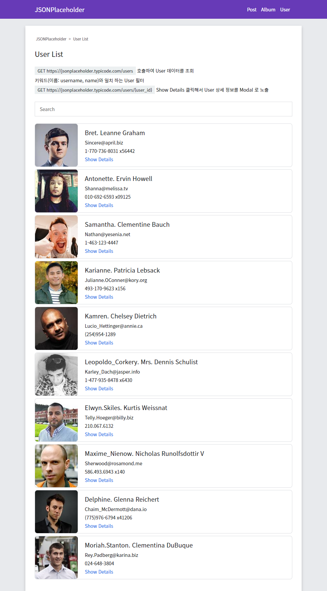

# JSONPlaceholder API 사용해서 Vue 프론트 사이트 만들기

## 샘플 화면




## 디렉토리 구성

````
└── src
    ├── api - JSONPlaceholder API 항목 정의
    ├── assets - 스타일 파일 정의
    ├── components - 컴포넌트 파일 정의
    │   └── UI - 공통으로 사용하는 UI 컴포넌트 정의
    │
    ├── helpers - 함수 정의
    ├── router - VueRouter
    ├── store - Vuex
    └── views - 페이지 파일 정의
````

## 프로젝트 설지
```
npm install
```

## 기능 정의
- Post
- Album
- User
  - [ ] https://jsonplaceholder.typicode.com/users 호출 하여 User 데이터를 노출 하시오.
  - [ ] 키워드(이름: username, name)와 일치 하는 User 데이터를 노출 하시오.
  - [ ] Show Details 클릭해서 Modal 노출 하시오.
  - [ ] Modal 노출 전 https://jsonplaceholder.typicode.com/users/{user_id} 호출 하여 User 데이터를 조회 하시오.

